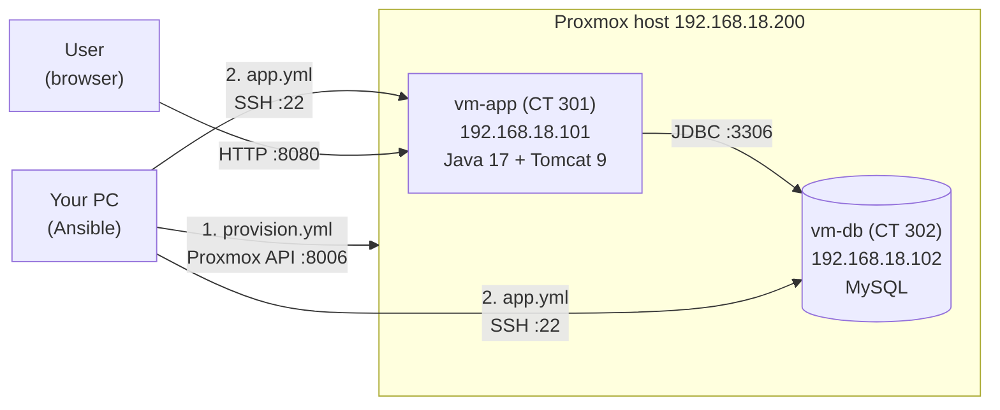

# How to deploy Travel Agency with Ansible

This guide shows how to create two servers in Proxmox and run the Travel Agency app on them.

- **vm-app** (`192.168.18.101`): Java 17, Maven, Tomcat 9. It builds and runs the app.
- **vm-db** (`192.168.18.102`): MySQL. It stores the data.

## How it works



1. `provision.yml` asks Proxmox to create and start the two containers.
2. `app.yml` connects to the containers over SSH, installs MySQL on `vm-db`,
   and builds and runs the app on `vm-app`.
3. The user opens `http://192.168.18.101:8080`. The app keeps its data in MySQL on `vm-db`.

---

## 1. Files in this folder
```
ansible/
├── ansible.cfg              # Ansible settings
├── inventory.ini            # servers and their IP addresses
├── requirements.yml         # extra Ansible collections
├── provision.yml            # step 1: create the containers in Proxmox
├── app.yml                  # step 2: install MySQL, build and run the app
├── travelagency.conf.j2     # template: database settings for Tomcat
├── group_vars/
│   └── vars.yml             # database name, user, Git repo, paths
├── .env.example             # example of the secrets file
├── .env                     # your real secrets (not in Git)
└── .gitignore               # keeps .env out of Git
```
| File | What it does |
|------|--------------|
| `ansible.cfg` | Main Ansible settings (inventory file, no SSH key check). |
| `inventory.ini` | List of servers and their IP addresses. |
| `requirements.yml` | Extra Ansible collections you must install. |
| `provision.yml` | Creates and starts the two containers in Proxmox. |
| `app.yml` | Installs MySQL, builds the app, and runs it in Tomcat. |
| `group_vars/vars.yml` | Settings: database name, user, Git repo, paths. |
| `travelagency.conf.j2` | Template. Gives the database address, user and password to Tomcat. |
| `.env.example` | Example of the secrets file. |
| `.env` | Your real secrets. **Do not put it in Git.** |

---

## 2. What you need

### On your PC (the Ansible machine)

- Linux (or WSL on Windows)
- Ansible 2.15 or newer
- Python libraries `proxmoxer` and `requests`
- An SSH key at `~/.ssh/id_ed25519` (and `~/.ssh/id_ed25519.pub`)

Install the tools (Ubuntu / Debian):

```bash
sudo apt update
sudo apt install -y ansible python3-proxmoxer python3-requests
```

Make an SSH key if you do not have one:

```bash
ssh-keygen -t ed25519
```

### In Proxmox

1. A user `ansible@pve` with an API token named `ansible`.
   - Go to **Datacenter → Permissions → Users** and add the user.
   - Go to **Datacenter → Permissions → API Tokens** and add the token.
   - Copy the **secret**. Proxmox shows it only once.
   - Give the user (and the token) enough rights, for example the role `PVEVMAdmin` on `/` plus `PVEDatastoreUser` on the storage.
2. The Ubuntu 22.04 container template:
   - Go to **local → CT Templates → Templates** and download `ubuntu-22.04-standard`.
3. Storage `local-lvm` and network bridge `vmbr0` (these exist by default).

---

## 3. First setup

Go to the Ansible folder:

```bash
cd travelagency/ansible
```

### 3.1 Install the Ansible collections

```bash
ansible-galaxy collection install -r requirements.yml
```

### 3.2 Make the secrets file

```bash
cp .env.example .env
nano .env
```

Put your real values in it:

```ini
DB_PASSWORD=YourStrongPassword
PROXMOX_TOKEN_SECRET=xxxxxxxx-xxxx-xxxx-xxxx-xxxxxxxxxxxx
```

> **Tip:** Do not use the symbols `%`, `"` or `\` in `DB_PASSWORD`. They break the Tomcat settings file.

### 3.3 Load the secrets

Run this in **every new terminal** before you run a playbook:

```bash
set -a; source .env; set +a
```

Check that it worked:

```bash
echo "$DB_PASSWORD"
```

---

## 4. Change the settings (if needed)

If your network is different, change these places:

| What | Where |
|------|-------|
| Proxmox IP, node name, template, disk, CPU, RAM | `provision.yml` |
| Container IDs, names and IPs | `provision.yml` → `containers` |
| Gateway (`gw=192.168.18.1`) | `provision.yml` → `netif` |
| Server IPs for Ansible | `inventory.ini` |
| Database name / user, who can connect | `group_vars/vars.yml` |
| Git repo and branch of the app | `group_vars/vars.yml` → `app_repo`, `app_version` |

> The IPs in `provision.yml` and `inventory.ini` must be the same.

---

## 5. Create the servers

```bash
ansible-playbook provision.yml
```

This creates the containers `301 (vm-app)` and `302 (vm-db)` and starts them.
Your public SSH key is copied into them, so you can log in as `root`.

Check that you can reach them:

```bash
ansible all -m ping
```

You should see `"ping": "pong"` for both servers.

---

## 6. Deploy the app

```bash
ansible-playbook app.yml
```

What happens:

1. **Check settings.** Stops if `DB_PASSWORD` is empty.
2. **vm-db:**
   - Installs MySQL.
   - Lets other servers connect (`bind-address = 0.0.0.0`).
   - Creates the database `travelagency` and the user `travel`.
3. **vm-app:**
   - Installs Java 17, Maven, Tomcat 9 and Git.
   - Downloads the code from GitHub.
   - Builds the WAR file with Maven (only when the code changed).
   - Writes the database settings for Tomcat.
   - Copies the WAR to Tomcat as `ROOT.war` and restarts Tomcat.
   - Waits until the site answers.

The first run can take **5 to 10 minutes** (Maven downloads many files).

---

## 7. Open the app

Open in your browser:

```
http://192.168.18.101:8080
```

The login page is at `/form-login`.

---

## 8. Update the app

Push your new code to GitHub, then run again:

```bash
set -a; source .env; set +a
ansible-playbook app.yml
```

Ansible pulls the new code, builds it again and restarts Tomcat.
If nothing changed, nothing is restarted.

> **Warning:** The app has `hibernate.hbm2ddl.auto: create` in `application.properties`.
> This means the database tables are **deleted and made again every time Tomcat starts**.
> All saved data (users, orders) is lost. Change it to `update` if you want to keep data.

---

## 9. Useful commands

| Task | Command |
|------|---------|
| Check playbook syntax | `ansible-playbook app.yml --syntax-check` |
| Dry run (no changes) | `ansible-playbook app.yml --check` |
| Show more details | `ansible-playbook app.yml -v` (or `-vvv`) |
| Run only on the database server | `ansible-playbook app.yml --limit db` |
| Log in to a server | `ssh root@192.168.18.101` |
| Tomcat logs | `ssh root@192.168.18.101 journalctl -u tomcat9 -f` |
| MySQL status | `ssh root@192.168.18.102 systemctl status mysql` |

---

## 10. Common problems

| Error | Why | Fix |
|-------|-----|-----|
| `'proxmox_token' is undefined` or empty token | Secrets are not loaded. | Run `set -a; source .env; set +a`. |
| `'db_password' is undefined` or `DB_PASSWORD is empty` | Secrets are not loaded. | Run `set -a; source .env; set +a`. |
| `No module named 'proxmoxer'` | Python library is missing. | `sudo apt install python3-proxmoxer python3-requests` |
| `CERTIFICATE_VERIFY_FAILED` | Proxmox uses a self-signed certificate. | Keep `validate_certs: false` in `provision.yml`. |
| `couldn't resolve module/action 'community.proxmox...'` | Collections are not installed. | `ansible-galaxy collection install -r requirements.yml` |
| `Could not find or access 'travelagency.conf.j2'` | Template file is missing. | Make sure `travelagency.conf.j2` is in this folder. |
| `UNREACHABLE` / `Permission denied (publickey)` | SSH key is wrong or the server is off. | Check the container is running and your key is `~/.ssh/id_ed25519`. |
| `Public Key Retrieval is not allowed` | MySQL 8 connection setting. | Keep `allowPublicKeyRetrieval=true` in `travelagency.conf.j2`. |
| `Wait until the site answers` fails | Tomcat could not start the app. | Look at `journalctl -u tomcat9` on vm-app. |
| `Non-blocking file handles detected` | Terminal issue (some IDE terminals). | Add `</dev/null` at the end of the command. |

---

## 11. Security notes

- **Never commit `.env` to Git.** Add this line to the main `.gitignore`:
  ```
  ansible/.env
  ```
- If a secret was shared by mistake, make a new one (new Proxmox token, new DB password).
- The database user `travel` can connect only from `192.168.18.%`.
