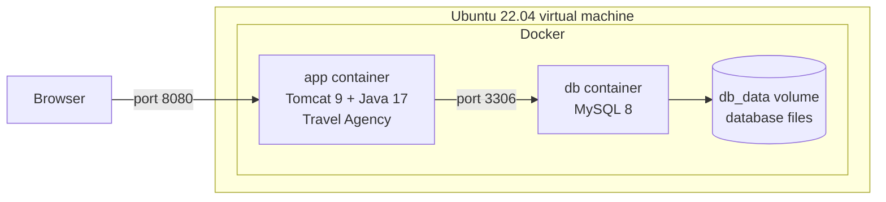
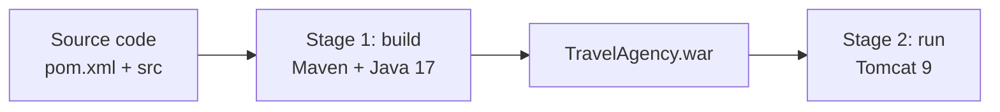

# How to run Travel Agency in Docker

This guide shows how to run the Travel Agency project in Docker on Ubuntu 22.04

The project uses two containers:

| Container | What it does |
|-----------|--------------|
| `app` | Builds the project with Maven and runs it in Tomcat 9 |
| `db` | Runs the MySQL 8 database |

## How it works

The browser talks to the `app` container. The `app` container talks to the `db` container. The database keeps its files in a Docker volume.



The `app` image is built in two stages:



## File structure

Files marked `new` are the files you create in this guide.

```text
travelagency/
├── src/
│   └── main/
│       ├── java/org/project/     Java code
│       ├── resources/            application.properties, insert.sql
│       └── webapp/WEB-INF/       JSP pages and styles
├── images/                       screenshots for README
├── pom.xml                       Maven settings
├── README.md
├── Dockerfile                    new - how to build the app image
├── .dockerignore                 new - files Docker does not copy
├── docker-compose.yml            new - describes the two containers
├── .env                          new - passwords (not saved in Git)
└── DOCKER.md                     new - this guide
```

## Step 1. Install Docker

```bash
sudo apt update
sudo apt install -y git docker.io docker-compose-v2
```

Allow your user to run Docker without `sudo`:

```bash
sudo usermod -aG docker $USER
newgrp docker
```

Check that Docker works:

```bash
docker --version
docker compose version
```

## Step 2. Download the project

```bash
cd ~
git clone https://github.com/nazariybu/travelagency.git
cd travelagency
```

## Step 3. Create a new branch

```bash
git checkout -b docker
```

## Step 4. Create the Dockerfile

Open a new file:

```bash
nano Dockerfile
```

Paste this text:

```dockerfile
# Stage 1: build the project
FROM maven:3.9-eclipse-temurin-17 AS build
WORKDIR /app
COPY pom.xml .
COPY src ./src
RUN mvn -B clean package -DskipTests

# Stage 2: run the project
FROM tomcat:9.0-jdk17-temurin
RUN rm -rf /usr/local/tomcat/webapps/*
COPY --from=build /app/target/TravelAgency.war /usr/local/tomcat/webapps/ROOT.war
EXPOSE 8080
CMD ["catalina.sh", "run"]
```

Save the file: press `Ctrl+O`, then `Enter`, then `Ctrl+X`.

## Step 5. Create the .dockerignore file

```bash
nano .dockerignore
```

Paste this text and save:

```text
.git
images
target
.env
```

## Step 6. Create the .env file

This file keeps the database name, user and passwords.

```bash
nano .env
```

Paste this text. **Change the passwords to your own.** Use only letters and numbers.

```text
DB_NAME=travelagency
DB_USER=travel
DB_PASSWORD=ChangeMe123
DB_ROOT_PASSWORD=ChangeMeRoot123
```

## Step 7. Create the docker-compose.yml file

```bash
nano docker-compose.yml
```

Paste this text and save:

```yaml
services:
  db:
    image: mysql:8.0
    restart: unless-stopped
    environment:
      MYSQL_DATABASE: ${DB_NAME}
      MYSQL_USER: ${DB_USER}
      MYSQL_PASSWORD: ${DB_PASSWORD}
      MYSQL_ROOT_PASSWORD: ${DB_ROOT_PASSWORD}
    volumes:
      - db_data:/var/lib/mysql
    healthcheck:
      test: ["CMD-SHELL", "mysqladmin ping -h 127.0.0.1 -uroot -p$$MYSQL_ROOT_PASSWORD"]
      interval: 5s
      timeout: 5s
      retries: 30
      start_period: 20s

  app:
    build: .
    restart: unless-stopped
    depends_on:
      db:
        condition: service_healthy
    environment:
      DB_TRAVELAGENCY_URL: "jdbc:mysql://db:3306/${DB_NAME}?useSSL=false&allowPublicKeyRetrieval=true&serverTimezone=UTC"
      DB_TRAVELAGENCY_USER: ${DB_USER}
      DB_TRAVELAGENCY_PASSWORD: ${DB_PASSWORD}
    ports:
      - "8080:8080"

volumes:
  db_data:
```

The `app` container starts only after the database is ready.

## Step 8. Build and start

```bash
docker compose up -d --build
```

The first build takes a few minutes.

Check that both containers are running:

```bash
docker compose ps
```

Look at the application logs:

```bash
docker compose logs -f app
```

Wait for the line `Server startup in ... ms`. Press `Ctrl+C` to stop reading the logs.

## Step 9. Open the application

Find the IP address of your virtual machine:

```bash
hostname -I
```

Open this address in your browser:

```text
http://YOUR_VM_IP:8080/
```

If the page does not open, allow port 8080:

```bash
sudo ufw allow 8080/tcp
```

## Step 10. Log in

1. Open `http://YOUR_VM_IP:8080/create`.
2. Create a new user.
3. Log in with this user.


## Useful commands

| Command | What it does |
|---------|--------------|
| `docker compose ps` | Show the containers |
| `docker compose logs -f app` | Show the application logs |
| `docker compose logs -f db` | Show the database logs |
| `docker compose restart app` | Restart the application |
| `docker compose down` | Stop the containers and keep the data |
| `docker compose down -v` | Stop the containers and delete the data |
| `docker compose up -d --build` | Build again after you change the code |
